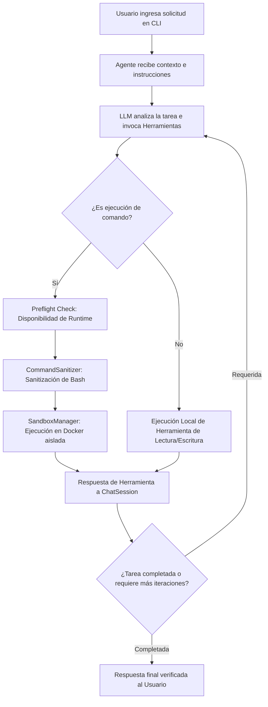

# Muss_Code 🐕 🌭 — Agente Autónomo de Desarrollo de Software

**Muss_Code** es un agente autónomo de desarrollo de software construido en Python sobre la API de OpenAI/NVIDIA. Analiza requisitos, revisa código, genera pruebas unitarias, detecta cambios, planifica y ejecuta tareas de forma autónoma mediante un **Agent Loop** en un entorno Sandbox aislado con **Docker** sin acceso a Internet.

---

## 📑 Tabla de Contenidos
1. [🚀 Guía Rápida: Instalación y Modo de Uso](#-guía-rápida-instalación-y-modo-de-uso)
2. [🤖 ¿Cómo Funciona el Agente?](#-cómo-funciona-el-agente)
3. [🧩 Arquitectura y Componentes](#-arquitectura-y-componentes)
4. [🔒 Modelo de Seguridad y Sandbox Docker](#-modelo-de-seguridad-y-sandbox-docker)
5. [🌐 Entorno de Desarrollo Web Offline](#-entorno-de-desarrollo-web-offline)
6. [📁 Estructura del Proyecto](#-estructura-del-proyecto)
7. [🧪 Ejecución de Pruebas](#-ejecución-de-pruebas)

---

## 🚀 Guía Rápida: Instalación y Modo de Uso

### 1. Requisitos Previos
- **Python 3.12+**
- **Docker Desktop** (debe estar abierto y corriendo)

### 2. Instalación
1. Clona el repositorio y entra en la carpeta:
   ```bash
   git clone git@github.com:JoseDaniel1802/agente-ia.git
   cd agente-ia
   ```

2. Crea y activa el entorno virtual de Python:
   ```bash
   python3 -m venv .venv
   source .venv/bin/activate   # Linux/macOS
   ```

3. Instala las dependencias:
   ```bash
   pip install -r requirements.txt
   ```

4. Configura tu clave de API en un archivo `.env` en la raíz del proyecto:
   ```env
   NVIDIA_API_KEY=tu_clave_nvidia
   NVIDIA_BASE_URL=https://integrate.api.nvidia.com/v1
   NVIDIA_MODEL=meta/llama-3.1-70b-instruct
   ```

---

### 3. Modo de Uso

Inicia Muss_Code ejecutando el CLI principal:

```bash
python3 main.py
```

Una vez iniciada la sesión interactiva, puedes escribir tus solicitudes en lenguaje natural. Ejemplos de uso:

```text
> Revisa la estructura del proyecto y analiza si hay errores de seguridad.
> Crea una API con Express en TypeScript que exponga un endpoint /saludo y ejecuta las pruebas.
> Refactoriza el módulo de comandos e implementa pruebas unitarias con pytest.
```

### Comandos Slash Disponibles en la Terminal

| Comando | Descripción |
| :--- | :--- |
| `/help` | Muestra la tabla de ayuda y comandos del agente. |
| `/status` | Muestra el estado del agente, workspace activo y disponibilidad de Docker Sandbox. |
| `/tools` | Lista las 12 herramientas registradas en el sistema. |
| `/workspace` | Muestra o cambia dinámicamente el workspace activo de trabajo. |
| `/clear` | Limpia la consola de la terminal. |
| `/exit` | Cierra la sesión de Muss_Code de forma segura. |

---

## 🤖 ¿Cómo Funciona el Agente?

Muss_Code opera bajo un ciclo de decisión y ejecución autónoma (**Agent Loop**) que interactúa iterativamente con el modelo de lenguaje (LLM) y las herramientas del sistema local:



### 🔄 Ciclo de Vida del Agent Loop
1. **Inspección Inicial (Environment First):** Antes de proponer o ejecutar código, el agente inspecciona el workspace activo, estructura de archivos y contexto necesario.
2. **Razonamiento y Selección de Herramientas:** El modelo genera llamadas a herramientas (*tool calls*) estructuradas en JSON.
3. **Validación Pre-flight:** Si la herramienta requiere un runtime (ej. Node.js o Python), el sistema valida fail-closed que el contenedor Docker esté disponible.
4. **Ejecución Aislada:** Los comandos se ejecutan dentro del sandbox efímero en Docker con límites estrictos de recursos.
5. **Detección de Bucles y Límite de Iteraciones:** Se detectan invocaciones idénticas consecutivas y se aplica un límite máximo de iteraciones (`MAX_TOOL_ITERATIONS`) para prevenir bucles infinitos.
6. **Seguimiento de Cambios (`TaskChangeState`):** Se registran de forma transparente los archivos creados, modificados, eliminados o restaurados durante la sesión.

---

## 🧩 Arquitectura y Componentes

| Módulo | Descripción / Responsabilidad |
| :--- | :--- |
| **`main.py`** | Punto de entrada del sistema. Inicializa la CLI interactiva. |
| **`agente.py`** | Cliente de API OpenAI/NVIDIA, esquemas JSON de las 12 herramientas, clase `ChatSession` y motor principal del Agent Loop. |
| **`herramientas.py`** | Implementación de las 12 herramientas locales invocables por el LLM. |
| **`seguridad.py`** | `WorkspaceManager` (prevención de Path Traversal) y `CommandSanitizer` (sanitización de Bash y desinfección de inyecciones). |
| **`sandbox.py`** | `SandboxManager`: orquestador de contenedores efímeros Docker para la ejecución segura de comandos. |
| **`instrucciones.py`** | Prompts del sistema, directivas de personalidad, reglas de no alucinación y principios de ingeniería de software. |
| **`cli/`** | Interfaz rica de terminal desarrollada con `Rich` y `Questionary` (`interfaz.py`, `comandos.py`, `presentacion.py`). |
| **`docker/Dockerfile.sandbox`** | Definición multi-stage de la imagen oficial del Sandbox offline (`muss_code_sandbox:latest`). |

---

## 🔒 Modelo de Seguridad y Sandbox Docker

Muss_Code aplica un modelo de **Seguridad en Capas (Zero-Trust y Fail-Closed)**:

### 1. Aislamiento en Docker (`SandboxManager`)
Cada comando ejecutado dentro del sandbox se corre en un contenedor efímero basado en `muss_code_sandbox:latest` con las siguientes restricciones obligatorias:
- **Red:** `--network none` (Red desactivada permanentemente durante la ejecución).
- **Filesystem Raíz:** `--read-only` (El sistema de archivos raíz de la imagen es completamente inmutable).
- **Directorio Temporal:** `--tmpfs /tmp:rw,noexec,nosuid,size=64m` (Memoria volátil en RAM para archivos temporales).
- **Privilegios:** `--cap-drop ALL`, `--security-opt no-new-privileges`, `--user 1000:1000` (Usuario no-root sin capacidades).
- **Volúmenes Montados:** Únicamente el workspace activo del usuario (`workspace:/workspace:rw`). Jamás se montan `$HOME`, `.ssh`, ni `/var/run/docker.sock`.
- **Límites de Recursos:** `--memory 512m`, `--cpus 1.0`, `--pids-limit 64`, `timeout_max 120s`.

### 2. Saneamiento de Comandos (`CommandSanitizer`)
- Bloqueo de operadores de shell peligrosos (`&&`, `;`, `|`, `$()`, backticks, redirecciones `>`).
- Bloqueo de binarios y comandos prohibidos (`sudo`, `su`, `curl`, `wget`, `nc`, `python -c`, `chmod`, `git config`).
- Restricción de rutas fuera del workspace autorizado.

### 3. Aislamiento de Rutas (`WorkspaceManager`)
- Validación estricta para evitar ataques de *Path Traversal* (`../`).
- Denylist de archivos sensibles que el agente jamás puede leer o modificar (`.env`, `*.pem`, claves privadas).

---

## 🌐 Entorno de Desarrollo Web Offline

La imagen Docker `muss_code_sandbox:latest` combina **Python 3.12** y **Node.js 22 LTS** con un conjunto de herramientas globales preinstaladas y un almacén de dependencias pre-cargadas para permitir desarrollo web sin acceso a Internet:

### CLIs Globales Pre-instaladas
- **TypeScript:** `tsc`, `tsx`, `ts-node`
- **Frameworks & Bundlers:** `@nestjs/cli` (`nest`), `vite`, `create-vite`
- **Linting & Formato:** `eslint`, `@typescript-eslint/parser`, `prettier`
- **Testing:** `vitest`, `pytest`

### Almacén Offline de Dependencias (`/var/pkg-store`)
- Almacena archivos tarball `.tgz` de las librerías web más comunes (`express`, `@types/express`, `@types/node`, `rxjs`, `reflect-metadata`, `@nestjs/core`, `@nestjs/common`, `dotenv`, etc.).
- Posee un índice inmutable `/var/pkg-store/index.json` consultado por el agente para realizar instalaciones offline mediante comandos atómicos:
  ```bash
  npm install /var/pkg-store/express-5.2.1.tgz
  ```
- **Sin `NODE_PATH`:** Las dependencias de las aplicaciones se instalan directamente en el `/workspace/node_modules` local del proyecto para mantener el estándar nativo de Node.js.

---

## 📁 Estructura del Proyecto

```
.
├── main.py                  # CLI principal: punto de entrada
├── agente.py                # Cliente API LLM, ChatSession y Agent Loop
├── herramientas.py          # Implementación de las 12 herramientas locales
├── seguridad.py             # WorkspaceManager y CommandSanitizer
├── sandbox.py               # SandboxManager (Orquestador de Docker Sandbox)
├── instrucciones.py         # System Prompt y directivas del agente
├── AGENTS.md                # Reglas de trabajo y convenciones del repositorio
├── Readme.md                # Documentación principal
├── requirements.txt         # Dependencias Python del proyecto
├── .env                     # Claves de API (NVIDIA/DeepSeek/OpenAI)
├── cli/                     # Módulo de interfaz gráfica de consola
│   ├── interfaz.py          # Bucle de interacción y comandos slash
│   ├── comandos.py          # Lógica de comandos de menú
│   └── presentacion.py      # Formateador visual Rich
├── docker/                  # Entorno Docker controlado
│   └── Dockerfile.sandbox   # Dockerfile de muss_code_sandbox:latest
├── .opencode/               # Configuración estandarizada de OpenCode
│   ├── agent/               # Definición del rol del agente
│   └── skills/              # 6 Habilidades declarativas (Markdown + YAML)
└── tests/                   # Suite de pruebas unitarias e integración (pytest)
```

---

## 🧪 Ejecución de Pruebas

El proyecto utiliza `pytest` para la suite de pruebas unitarias y de integración:

```bash
# Ejecutar una suite específica (ej. seguridad del sandbox)
.venv/bin/python -m pytest tests/test_seguridad_sandbox.py -v --tb=short

# Ejecutar la suite completa de pruebas
.venv/bin/python -m pytest tests/ -v --tb=short
```
